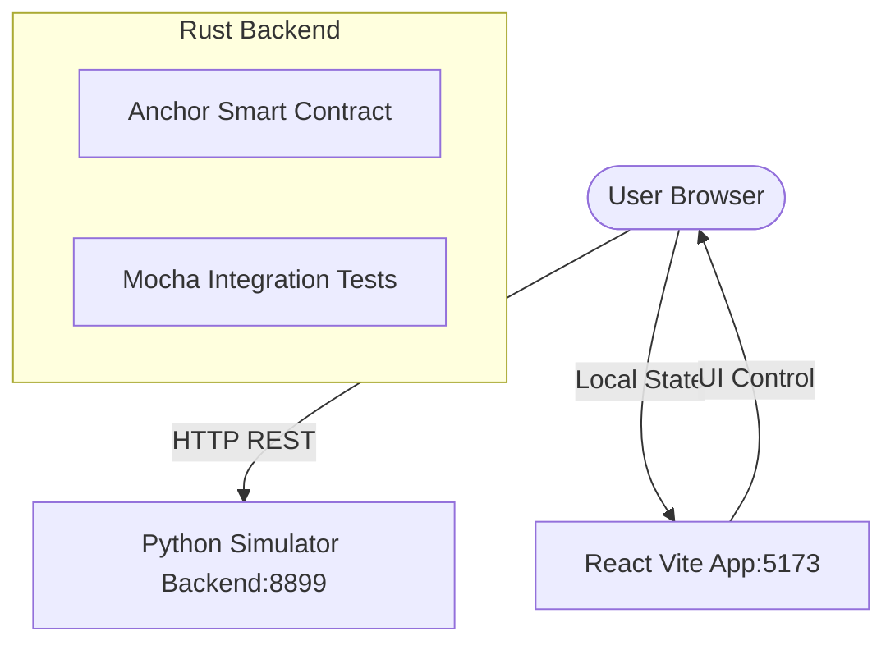

# Solana Yield Vibe - Staking Simulator

A local staking simulator with a simulated Python backend and a React Vite + TypeScript + TailwindCSS v4 frontend. This project simulates yield staking metrics, user dashboards, staking transactions, and real-time unclaimed reward accumulation.

---

## AI PM Vision & Prototype Experiment

This repository was created as an experiment by an **AI Product Manager** to test **how rapidly AI can scaffold and develop functioning Web3 prototypes** to enable and accelerate development teams in the future. 

By utilizing simulated ledger API loops alongside actual SBF smart contracts, we bypassed complex OS-specific toolchain bottlenecks to successfully create a fully interactive, real-time staking dashboard prototype in minutes.

---

## What is Left to Build for Production

To take this prototype from local simulation to a live production Solana DApp, the following steps are required:

1. **On-Chain Wallet Integration**:
   - Swap out the simulated local storage wallet system in `app/src/App.tsx` for a standard Solana Wallet Adapter (`@solana/wallet-adapter-react`).
   - Hook up the wallet provider to allow real user wallets (like Phantom or Solflare) to sign transactions.
2. **Live Solana Devnet/Mainnet Deploy**:
   - Boot a devnet connection instead of connecting to `localhost`.
   - Deploy the compiled SBF contract (`target/deploy/solana_yield_vibe.so`) using `solana program deploy` or `anchor deploy`.
   - Setup a script to transfer the `mint_authority` of the reward mint to the newly deployed Program PoolState PDA address on-chain.
3. **Upgrade Anchor to v0.31.1+**:
   - Upgrade the Anchor CLI and package dependencies to `0.31.1` or later. This officially patches the dependency version conflicts in `proc-macro2` (which currently require compiling with `--no-idl` on macOS).
4. **On-Chain Yield Testing**:
   - Run the Mocha test suite (`tests/solana-yield-vibe.ts`) against a live devnet connection to verify transaction cost overhead and performance.

---

## Project Architecture



---

## macOS Development Challenges & Ubuntu Migration

During development on macOS, two primary issues arose:
1. **Unstable Rust Compiler APIs (`proc-macro2`)**: 
   Anchor `0.30.1` relies on unstable internal APIs (like `Span::source_file`) that were modified in newer releases of `proc-macro2` (v1.0.95+). This creates a dependency resolution conflict between the host compiler (Rust `1.96.0`) and the Solana SBF toolchain (Rust `1.75.0-dev`).
2. **macOS AppleDouble Files (`._genesis.bin`)**: 
   When running `solana-test-validator` on mounted macOS volumes (`/Volumes/Data/`), macOS default BSD `tar` automatically injects hidden metadata files prefixed with `._`. The Solana validator’s ledger unpacker fails with:
   `Archive error: extra entry found: "._genesis.bin" Regular`
   
### Ubuntu Migration Path (What to Try on Ubuntu)
These issues are unique to macOS filesystem metadata and BSD-style tools. When deploying or developing on **Ubuntu/Linux**, you can run the live blockchain validator seamlessly:
- **No AppleDouble Files**: Ubuntu filesystems (like ext4) do not generate dot-underbar metadata files, avoiding the validator crash.
- **Native GNU Tar**: Ubuntu packages native GNU `tar` by default, allowing the ledger to unpack cleanly.
- **Consistent Compiler Toolchains**: Package managers on Linux align easily with Solana's target Rust environments.

---

## How to Run the Simulator (macOS & Development)

### 1. Start the Python Simulator Backend
The Python backend simulates the Solana staking program logic (including real-time yield accumulation, minting reward tokens, and staking vaults) on port `8899`. It runs using Python's standard library with zero external dependencies.

```bash
python3 backend/server.py
```

### 2. Start the React Frontend
Navigate to the `/app` folder, install the Vite dependencies, and start the development server.

```bash
cd app
npm install
npm run dev
```

Open your browser at the local URL (usually [http://localhost:5173](http://localhost:5173)) to interact with the dashboard:
- Use the **Airdrop Faucet** to fund your simulated wallet with `1,000 SOL` and `1,000,000 STAKE` tokens.
- **Initialize the Pool** (admin action) with a reward rate.
- **Stake** your principal and watch your reward balance tick up in real time!
- **Claim** your simulated yield or **Unstake** your principal at any time.

---

## How to Run the Live Solana Validator & Program (Ubuntu)

On an Ubuntu machine, you can run the actual Rust/Anchor program on a local validator using the following commands:

### 1. Build the Solana Program
```bash
anchor build
```

### 2. Run the Local Validator & Deploy
To spin up a local validator and deploy the contract in one command, run:
```bash
solana-test-validator --reset
# In a separate terminal, deploy the program:
anchor deploy
```

### 3. Run Integration Tests
Run the Mocha TypeScript integration tests (`tests/solana-yield-vibe.ts`) validating the full `Stake -> Wait -> Claim -> Unstake` lifecycle:
```bash
anchor test
```
